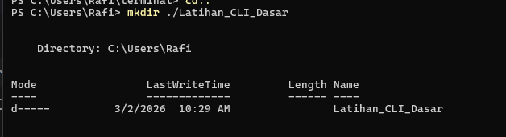
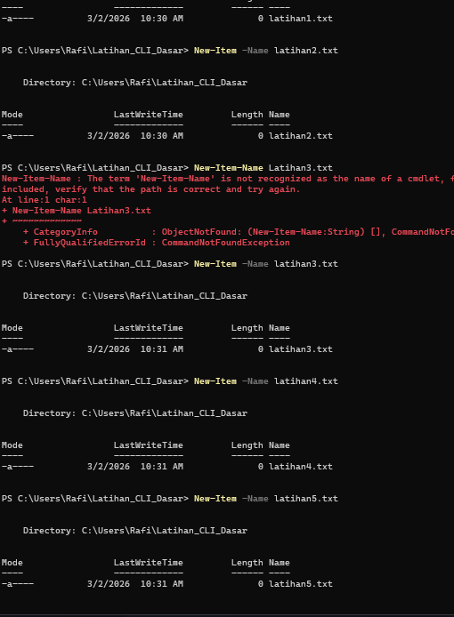
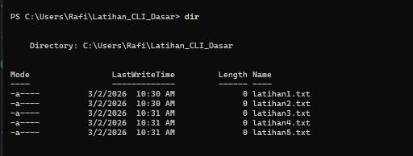
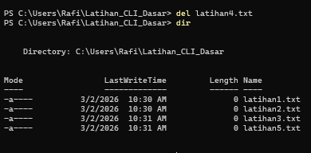
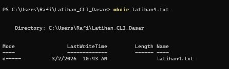
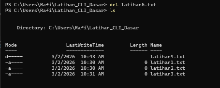
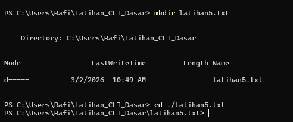
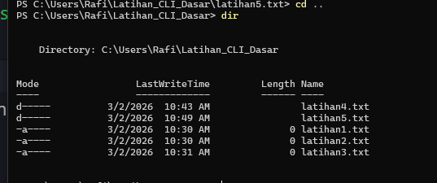
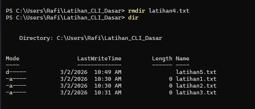

# Minitask CLI

- Membuat Folder "Latihan_CLI_Dasar".
  
- Membuat file kosong sebanyak 5 kali.
  
- Melihat daftar file yang sudah dibuat.
  
- Menghapus file dengan urutan ke 4.
  
- Membuat Folder dengan nama "latihan4.txt".
  
- Menghapus file dengan urutan ke 5.
  
- Membuat folder dengan nama "latihan5.txt".
  
- Melihat daftar file dan folder yang sudah dibuat.
  
- Menghapus Folder dengan nama "latihan4.txt".
  
